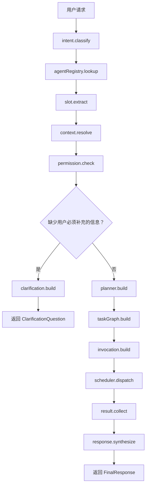
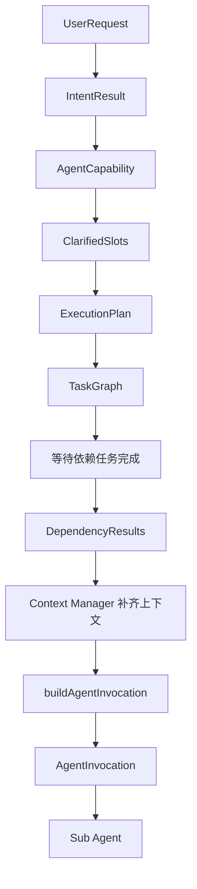

# 主 Agent 与子 Agent 交互设计文档

> 本文专门描述主 Agent 如何工作、主 Agent 有哪些工具、主 Agent 会输出什么，以及这些输出如何变成子 Agent 的输入。
>
> 本文不展开每个子 Agent 内部如何完成专业任务，只关注编排层协议。

## 1. 核心结论

主 Agent 的输出不只有“最终回复”。在多 Agent 架构里，主 Agent 会产生多种编排输出，其中最关键的是：

| 主 Agent 输出 | 发给谁 | 用途 |
| --- | --- | --- |
| `IntentResult` | 主 Agent 内部 / 前端 | 说明用户意图、目标 Agent、缺失参数 |
| `ClarificationQuestion` | 前端 / 用户 | 缺少用户必须补充的信息时追问 |
| `ExecutionPlan` | 前端 / Scheduler | 展示执行计划，并作为任务调度依据 |
| `TaskGraph` | Scheduler | 表达任务节点、依赖关系、串行/并行策略 |
| `AgentInvocation` | 子 Agent | 子 Agent 真正收到的完整输入包 |
| `SynthesisInput` | 主 Agent 汇总阶段 | 收集子 Agent 结果，用于最终总结 |
| `FinalResponse` | 前端 / 用户 | 最终自然语言回复、产物、推荐追问 |

其中最重要的链路是：

```text
用户请求
  ↓
主 Agent 识别意图
  ↓
主 Agent 生成 ExecutionPlan / TaskGraph
  ↓
主 Agent 调用 Context Manager 补上下文
  ↓
主 Agent / Scheduler 构造 AgentInvocation
  ↓
子 Agent 接收 AgentInvocation 并执行
  ↓
子 Agent 返回 TaskResult
  ↓
主 Agent 汇总 FinalResponse
```

一句话：

> 主 Agent 给子 Agent 的不是一段对话，也不是一句命令，而是一个结构化的 `AgentInvocation`。

## 2. 职责边界

### 2.1 主 Agent 负责什么

主 Agent 是编排者，负责把用户的自然语言请求变成可执行任务。

主 Agent 负责：

1. 理解用户需求。
2. 查询 Agent Registry，确定应该调用哪些子 Agent。
3. 判断是否需要向用户澄清。
4. 生成执行计划。
5. 判断任务依赖关系。
6. 调用 Context Manager 补齐业务上下文和运行上下文。
7. 构造子 Agent 输入 `AgentInvocation`。
8. 调度子 Agent 执行。
9. 收集子 Agent 输出。
10. 汇总最终回复和产物。

主 Agent 不负责：

- 不直接实现学情分析、课件生成、组题、批改等专业逻辑。
- 不硬编码每个子 Agent 的所有业务字段。
- 不让多个子 Agent 直接向用户提问。
- 不把完整聊天历史无筛选地传给子 Agent。

### 2.2 子 Agent 负责什么

子 Agent 是专业执行者，只处理主 Agent 分配给自己的任务。

子 Agent 负责：

1. 接收 `AgentInvocation`。
2. 校验 `taskInput` 是否符合自己的 `inputSchema`。
3. 读取被允许的上下文。
4. 调用白名单工具。
5. 输出结构化 `TaskResult`。
6. 上报执行过程事件。

子 Agent 不负责：

- 不直接面对用户。
- 不决定是否要澄清用户。
- 不读取无关上下文。
- 不决定全局执行计划。
- 不生成最终总回复。

## 3. 主 Agent 可用工具

这里的“工具”不是子 Agent 的业务工具，而是主 Agent 为完成编排需要调用的框架能力。

### 3.1 主 Agent 工具总览

| 工具 | 输入 | 输出 | 作用 |
| --- | --- | --- | --- |
| `intent.classify` | 用户 query、会话摘要 | `IntentResult` | 判断用户想做什么 |
| `agentRegistry.lookup` | 意图、业务领域 | 子 Agent 能力列表 | 找到可用子 Agent |
| `slot.extract` | 用户 query、上下文、requiredSlots | 已识别参数 | 从用户表达中提取参数 |
| `context.resolve` | contextRequirements、用户身份 | 业务/运行上下文 | 自动补齐老师、班级、作文维度等 |
| `permission.check` | 用户身份、资源 ID、动作 | 允许/拒绝 | 防止越权访问 |
| `clarification.build` | missingUserSlots、候选选项 | 澄清问题 | 生成用户可理解的问题 |
| `planner.build` | 意图、参数、目标 Agent | `ExecutionPlan` | 生成用户可见执行计划 |
| `taskGraph.build` | plan、依赖判断 | `TaskGraph` | 生成调度图 |
| `invocation.build` | task、上下文、依赖结果 | `AgentInvocation` | 构造子 Agent 输入 |
| `scheduler.dispatch` | TaskGraph / AgentInvocation | task run id | 派发任务 |
| `result.collect` | task run ids | TaskResult[] | 收集子 Agent 输出 |
| `response.synthesize` | 用户目标、计划、TaskResult[] | `FinalResponse` | 汇总最终回复 |
| `event.publish` | 编排事件 | 前端事件流 | 让前端展示过程 |

### 3.2 主 Agent 工具调用顺序



注意：

- `context.resolve` 补的是系统能自动获取的信息，例如老师名称、作文维度、权限范围。
- `clarification.build` 只问用户必须补充的信息，例如班级、时间范围、题型偏好。
- 子 Agent 不直接执行澄清，最多返回 `invalid_input` 给主 Agent。

## 4. 主 Agent 输出总览

### 4.1 输出 1：`IntentResult`

`IntentResult` 是主 Agent 对用户请求的第一层理解。

```ts
type IntentResult = {
  intentType: "single_full" | "single_lack" | "multi_parallel" | "multi_depend" | "other";
  domain: "courseware" | "animation" | "analysis" | "grading" | "misprint" | "quiz" | "chat";
  confidence: number;
  targetAgents: string[];
  missingUserSlots: string[];
  requiredContext: string[];
  reason: string;
};
```

示例：

```json
{
  "intentType": "multi_depend",
  "domain": "courseware",
  "confidence": 0.92,
  "targetAgents": ["learning_analysis_agent", "courseware_agent"],
  "missingUserSlots": ["classId"],
  "requiredContext": ["teacherProfile", "classPermission", "writingDimensions"],
  "reason": "用户要求先分析薄弱项，再生成讲评课件；第二步依赖第一步结果"
}
```

用途：

- 告诉前端当前识别到的任务类型。
- 告诉主 Agent 下一步是否要澄清。
- 告诉 Registry 和 Planner 应该选择哪些子 Agent。

### 4.2 输出 2：`ClarificationQuestion`

当缺少用户必须补充的信息时，主 Agent 输出澄清问题。

```ts
type ClarificationQuestion = {
  question: string;
  slots: string[];
  options?: Array<{
    label: string;
    value: string;
  }>;
  allowCustomInput: boolean;
  customPlaceholder?: string;
};
```

示例：

```json
{
  "question": "好的。你这次想分析哪个班级？",
  "slots": ["classId"],
  "options": [
    { "label": "初二(3)班", "value": "class_8_3" },
    { "label": "初二(5)班", "value": "class_8_5" }
  ],
  "allowCustomInput": true,
  "customPlaceholder": "比如：初三(2)班，只看作文部分"
}
```

澄清答案进入 `clarifiedSlots`，后续会进入 `mainAgentContext` 和 `taskInput`。

### 4.3 输出 3：`ExecutionPlan`

`ExecutionPlan` 是主 Agent 给用户和调度系统看的计划。

```ts
type ExecutionPlan = {
  planId: string;
  strategy: "single" | "parallel" | "sequential" | "dag";
  userVisibleText: string;
  tasks: PlannedTask[];
};

type PlannedTask = {
  taskId: string;
  title: string;
  agentType: string;
  dependsOn: string[];
  taskInput: Record<string, unknown>;
  expectedOutputSchema: string;
};
```

示例：

```json
{
  "planId": "plan_001",
  "strategy": "sequential",
  "userVisibleText": "第二步依赖第一步的分析结果，我会按顺序执行。",
  "tasks": [
    {
      "taskId": "task_001",
      "title": "分析班级学情",
      "agentType": "learning_analysis_agent",
      "dependsOn": [],
      "taskInput": {
        "classId": "class_8_3",
        "subject": "chinese",
        "timeRange": "last_7_days"
      },
      "expectedOutputSchema": "LearningAnalysisResult"
    },
    {
      "taskId": "task_002",
      "title": "生成讲评课件",
      "agentType": "courseware_agent",
      "dependsOn": ["task_001"],
      "taskInput": {
        "classId": "class_8_3",
        "coursewareType": "lecture_review"
      },
      "expectedOutputSchema": "CoursewareResult"
    }
  ]
}
```

注意：

- `ExecutionPlan` 不是最终给子 Agent 的输入。
- `ExecutionPlan.tasks[].taskInput` 只是任务级输入，还缺少上下文、依赖结果和附件产物。
- 真正发给子 Agent 的是下一节的 `AgentInvocation`。

### 4.4 输出 4：`TaskGraph`

`TaskGraph` 是调度系统使用的任务图。它可以从 `ExecutionPlan` 派生。

```ts
type TaskGraph = {
  graphId: string;
  strategy: "single" | "parallel" | "sequential" | "dag";
  nodes: TaskNode[];
};

type TaskNode = {
  taskId: string;
  agentType: string;
  title: string;
  dependsOn: string[];
  status: "pending" | "blocked" | "running" | "completed" | "failed";
};
```

示例：

```json
{
  "graphId": "graph_001",
  "strategy": "sequential",
  "nodes": [
    {
      "taskId": "task_001",
      "agentType": "learning_analysis_agent",
      "title": "分析班级学情",
      "dependsOn": [],
      "status": "pending"
    },
    {
      "taskId": "task_002",
      "agentType": "courseware_agent",
      "title": "生成讲评课件",
      "dependsOn": ["task_001"],
      "status": "blocked"
    }
  ]
}
```

### 4.5 输出 5：`AgentInvocation`

`AgentInvocation` 是主 Agent 输出给子 Agent 的关键结构。

可以把它理解为：

```text
AgentInvocation = 当前任务 + 用户需求 + 主 Agent 理解 + 前序结果 + 业务上下文 + 运行上下文 + 附件产物
```

```ts
type AgentInvocation<TTaskInput = unknown, TDependency = unknown> = {
  userQuery: {
    original: string;
    normalized?: string;
    relevantExcerpt?: string;
  };

  task: {
    taskId: string;
    title: string;
    goal: string;
    agentType: string;
  };

  taskInput: TTaskInput;

  mainAgentContext: {
    intentType: string;
    clarifiedSlots: Record<string, unknown>;
    planSummary: string;
    constraints: string[];
    expectedOutput: string;
    handoffReason: string;
  };

  dependencyResults: TDependency[];

  domainContext: {
    subject?: string;
    grade?: string;
    textbookVersion?: string;
    writingDimensions?: string[];
    rubricId?: string;
    rubricConfig?: Record<string, unknown>;
    knowledgeBaseIds?: string[];
    classProfile?: Record<string, unknown>;
  };

  runtimeContext: {
    teacherId: string;
    teacherName: string;
    schoolId: string;
    role: string;
    timezone: string;
    locale: "zh-CN";
    permissionScope: string[];
    requestId: string;
    traceId: string;
  };

  artifactContext: {
    attachments: ArtifactRef[];
    previousArtifacts: ArtifactRef[];
  };
};
```

示例：

```json
{
  "userQuery": {
    "original": "先分析本次测验薄弱项，再生成讲评课件",
    "normalized": "分析初二(3)班本次测验薄弱项，并基于结果生成讲评课件",
    "relevantExcerpt": "生成讲评课件"
  },
  "task": {
    "taskId": "task_002",
    "title": "生成讲评课件",
    "goal": "基于学情分析结果生成一份班级讲评课件",
    "agentType": "courseware_agent"
  },
  "taskInput": {
    "classId": "class_8_3",
    "coursewareType": "lecture_review"
  },
  "mainAgentContext": {
    "intentType": "multi_depend",
    "clarifiedSlots": {
      "classId": "class_8_3"
    },
    "planSummary": "先分析班级薄弱项，再基于分析结果生成讲评课件",
    "constraints": ["第二步必须使用第一步的分析结论"],
    "expectedOutput": "8 页 HTML 讲评课件，包含问题概览、案例讲评和课后练习",
    "handoffReason": "需要生成教学课件，匹配 courseware_agent 能力"
  },
  "dependencyResults": [
    {
      "taskId": "task_001",
      "agentType": "learning_analysis_agent",
      "summary": "识别出 3 个高频共性问题",
      "data": {
        "topIssues": [
          { "name": "论据偏单一", "count": 18 },
          { "name": "即/既混用", "count": 11 },
          { "name": "开头偏弱", "count": 9 }
        ]
      },
      "artifacts": ["artifact_analysis_001"]
    }
  ],
  "domainContext": {
    "subject": "chinese",
    "grade": "初二",
    "writingDimensions": ["立意", "结构", "论据", "语言"],
    "knowledgeBaseIds": ["kb_writing_materials"]
  },
  "runtimeContext": {
    "teacherId": "teacher_001",
    "teacherName": "王老师",
    "schoolId": "school_001",
    "role": "teacher",
    "timezone": "Asia/Shanghai",
    "locale": "zh-CN",
    "permissionScope": ["class_8_3"],
    "requestId": "req_abc",
    "traceId": "trace_abc"
  },
  "artifactContext": {
    "attachments": [],
    "previousArtifacts": [
      {
        "artifactId": "artifact_analysis_001",
        "kind": "html",
        "title": "初二(3)班学情分析报告.html",
        "previewUrl": "/artifacts/artifact_analysis_001/preview"
      }
    ]
  }
}
```

## 5. 主 Agent 输出如何变成子 Agent 输入

### 5.1 转换关系

| 主 Agent 中间输出 | 如何进入子 Agent 输入 |
| --- | --- |
| 用户原始请求 | 进入 `AgentInvocation.userQuery.original` |
| 主 Agent 规整后的用户意图 | 进入 `userQuery.normalized` 和 `mainAgentContext.intentType` |
| 澄清答案 | 同时进入 `taskInput` 和 `mainAgentContext.clarifiedSlots` |
| 执行计划摘要 | 进入 `mainAgentContext.planSummary` |
| 任务节点 | 进入 `task` 和 `taskInput` |
| 依赖关系 | 进入 `task.dependsOn` 的调度关系，并在执行时转换为 `dependencyResults` |
| 前序子 Agent 输出 | 进入后续 Agent 的 `dependencyResults` |
| Context Manager 补齐的信息 | 进入 `domainContext` 和 `runtimeContext` |
| 上传附件 / 已生成产物 | 进入 `artifactContext` |

### 5.2 构造流程



### 5.3 `buildAgentInvocation` 伪代码

```ts
async function buildAgentInvocation(params: {
  userRequest: UserRequest;
  intentResult: IntentResult;
  plan: ExecutionPlan;
  task: PlannedTask;
  completedResults: Map<string, TaskResult>;
  conversationContext: ConversationContext;
}): Promise<AgentInvocation> {
  const capability = await agentRegistry.lookup(params.task.agentType);

  const dependencyResults = params.task.dependsOn.map(taskId => {
    const result = params.completedResults.get(taskId);
    if (!result) throw new Error(`Missing dependency result: ${taskId}`);
    return result;
  });

  const domainContext = await context.resolveDomainContext({
    requirements: capability.contextRequirements,
    taskInput: params.task.taskInput,
    userRequest: params.userRequest
  });

  const runtimeContext = await context.resolveRuntimeContext({
    userId: params.userRequest.userId,
    traceId: params.userRequest.traceId
  });

  await permission.check({
    userId: runtimeContext.teacherId,
    scope: runtimeContext.permissionScope,
    taskInput: params.task.taskInput,
    action: "agent.invoke"
  });

  return {
    userQuery: {
      original: params.userRequest.text,
      normalized: params.conversationContext.normalizedUserGoal,
      relevantExcerpt: extractRelevantExcerpt(params.userRequest.text, params.task)
    },
    task: {
      taskId: params.task.taskId,
      title: params.task.title,
      goal: buildTaskGoal(params.task, params.plan),
      agentType: params.task.agentType
    },
    taskInput: params.task.taskInput,
    mainAgentContext: {
      intentType: params.intentResult.intentType,
      clarifiedSlots: params.conversationContext.clarifiedSlots,
      planSummary: params.plan.userVisibleText,
      constraints: buildConstraints(params.task, params.plan),
      expectedOutput: params.task.expectedOutputSchema,
      handoffReason: buildHandoffReason(params.task, capability)
    },
    dependencyResults,
    domainContext,
    runtimeContext,
    artifactContext: {
      attachments: params.userRequest.attachments,
      previousArtifacts: collectPreviousArtifacts(dependencyResults)
    }
  };
}
```

## 6. 主 Agent 与子 Agent 的交互协议

### 6.1 派发任务

主 Agent 通过 Scheduler 派发任务，不直接调用子 Agent 内部函数。

```ts
type TaskDispatchMessage = {
  type: "task_dispatch";
  traceId: string;
  parentRunId: string;
  taskId: string;
  to: string;
  payload: {
    invocation: AgentInvocation;
    constraints: {
      timeoutMs: number;
      maxToolCalls: number;
      allowedTools: string[];
    };
    expectedOutputSchema: string;
  };
};
```

### 6.2 子 Agent 过程事件

子 Agent 执行时，不断返回过程事件。主 Agent 或 Scheduler 把这些事件转发给前端。

```ts
type TaskProgressEvent = {
  type: "task_progress";
  traceId: string;
  parentRunId: string;
  taskId: string;
  agentType: string;
  status: "running" | "tool_calling" | "completed" | "failed";
  text: string;
  toolCall?: {
    toolName: string;
    status: "started" | "succeeded" | "failed";
    inputSummary?: string;
    outputSummary?: string;
  };
};
```

### 6.3 子 Agent 结果

子 Agent 必须返回结构化结果，不能只返回自然语言。

```ts
type TaskResult<TData = unknown> = {
  type: "task_result";
  traceId: string;
  parentRunId: string;
  taskId: string;
  agentType: string;
  status: "completed" | "failed" | "partial";
  summary: string;
  data: TData;
  artifacts: ArtifactRef[];
  warnings: string[];
  error?: {
    code: string;
    message: string;
    missingFields?: string[];
    retryable: boolean;
  };
};
```

如果子 Agent 发现输入不合法，不直接问用户，而是返回：

```json
{
  "type": "task_result",
  "taskId": "task_002",
  "agentType": "courseware_agent",
  "status": "failed",
  "summary": "课件生成失败：缺少课件主题",
  "data": null,
  "artifacts": [],
  "warnings": [],
  "error": {
    "code": "INVALID_INPUT",
    "message": "缺少 topic 字段",
    "missingFields": ["topic"],
    "retryable": false
  }
}
```

这通常说明：

- 主 Agent 澄清不足。
- Agent Registry 的 `requiredSlots` 配置不完整。
- `buildAgentInvocation` 装配逻辑有问题。

## 7. 主 Agent 汇总阶段

当所有子任务完成后，主 Agent 不直接拼接子 Agent 文本，而是构造 `SynthesisInput`。

```ts
type SynthesisInput = {
  userQuery: string;
  intentResult: IntentResult;
  executionPlan: ExecutionPlan;
  taskResults: TaskResult[];
  artifacts: ArtifactRef[];
  warnings: string[];
};
```

然后输出 `FinalResponse`：

```ts
type FinalResponse = {
  text: string;
  artifacts: ArtifactRef[];
  followups: string[];
  processSummary: {
    strategy: "single" | "parallel" | "sequential" | "dag";
    completedTasks: Array<{
      taskId: string;
      title: string;
      summary: string;
    }>;
    failedTasks: Array<{
      taskId: string;
      title: string;
      reason: string;
    }>;
  };
};
```

示例：

```json
{
  "text": "课件已生成，共 8 页，涵盖班级整体表现、3 个高频问题剖析和课后练习。已在右侧打开预览。",
  "artifacts": [
    {
      "artifactId": "artifact_courseware_001",
      "kind": "html",
      "title": "初二(3)班 · 议论文讲评课件.html",
      "previewUrl": "/artifacts/artifact_courseware_001/preview"
    }
  ],
  "followups": [
    "这些错题对应哪些知识点？",
    "再给一份学生版课后练习",
    "把课件导出成 PDF"
  ],
  "processSummary": {
    "strategy": "sequential",
    "completedTasks": [
      {
        "taskId": "task_001",
        "title": "分析班级学情",
        "summary": "识别出 3 个高频共性问题"
      },
      {
        "taskId": "task_002",
        "title": "生成讲评课件",
        "summary": "生成 8 页 HTML 讲评课件"
      }
    ],
    "failedTasks": []
  }
}
```

## 8. 两种典型链路

### 8.1 串行依赖链路

用户：

```text
先分析本次测验薄弱项，再生成讲评课件
```

主 Agent 输出：

```text
ExecutionPlan:
  task_001: learning_analysis_agent
  task_002: courseware_agent, dependsOn task_001
```

子 Agent 输入变化：

```text
task_001 AgentInvocation:
  dependencyResults = []

task_002 AgentInvocation:
  dependencyResults = [task_001 的 TaskResult]
```

关键点：

- 第二个子 Agent 不需要自己去查第一个子 Agent 做了什么。
- 主 Agent / Scheduler 会把前序结果装配进 `dependencyResults`。
- 子 Agent 只需要按 `AgentInvocation` 执行。

### 8.2 并行无依赖链路

用户：

```text
同时生成一份数学卷和一份语文阅读练习
```

主 Agent 输出：

```text
ExecutionPlan:
  strategy = parallel
  task_001: quiz_agent, subject = math
  task_002: quiz_agent, subject = chinese
```

子 Agent 输入变化：

```text
task_001 AgentInvocation:
  taskInput.subject = math
  dependencyResults = []

task_002 AgentInvocation:
  taskInput.subject = chinese
  dependencyResults = []
```

关键点：

- 两个任务互不等待。
- 两个子 Agent 都会拿到自己的 `taskInput`。
- 主 Agent 最终汇总两个 `TaskResult`。

## 9. 研发实现建议

### 9.1 推荐模块

```text
agent/
  main-agent.ts
  intent-router.ts
  planner.ts
  synthesizer.ts

registry/
  agent-registry.ts

context/
  context-manager.ts
  domain-context-resolver.ts
  runtime-context-resolver.ts

scheduler/
  task-graph.ts
  task-scheduler.ts
  invocation-builder.ts

protocol/
  intent-result.ts
  execution-plan.ts
  agent-invocation.ts
  task-result.ts
  final-response.ts
```

### 9.2 最小开发顺序

1. 定义 `AgentCapability`。
2. 定义 `ExecutionPlan`。
3. 定义 `AgentInvocation`。
4. 实现 `agentRegistry.lookup`。
5. 实现 `context.resolve`。
6. 实现 `buildAgentInvocation`。
7. 实现 `scheduler.dispatch`。
8. 实现 `TaskResult` 收集和 `FinalResponse` 汇总。

## 10. 关键约定

1. 主 Agent 是唯一直接面向用户澄清的 Agent。
2. 子 Agent 的输入统一是 `AgentInvocation`。
3. `ExecutionPlan` 是计划，不是子 Agent 的最终输入。
4. `TaskResult` 必须结构化，不能只返回自然语言。
5. 前序任务结果必须通过 `dependencyResults` 传给后续子 Agent。
6. 老师名称、作文维度、权限范围等环境信息由 Context Manager 补齐。
7. 子 Agent 需要什么字段，由自己的 `AgentCapability` 和 `inputSchema` 声明。
8. 主 Agent 不硬编码所有子 Agent 字段，只读取注册表并装配调用包。
