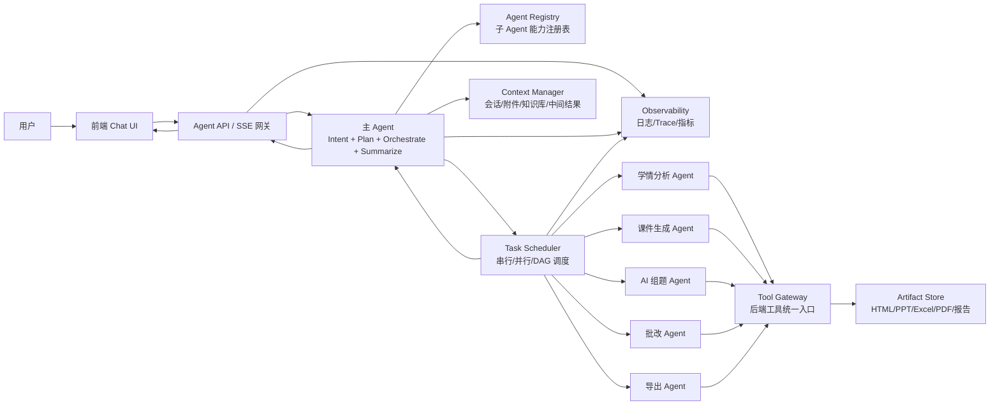
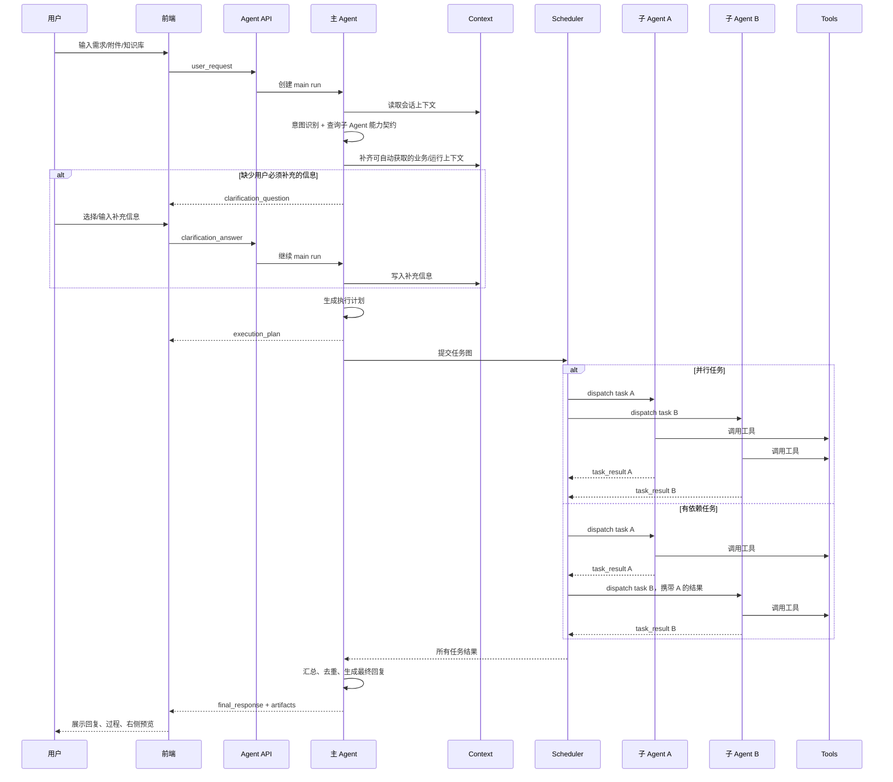
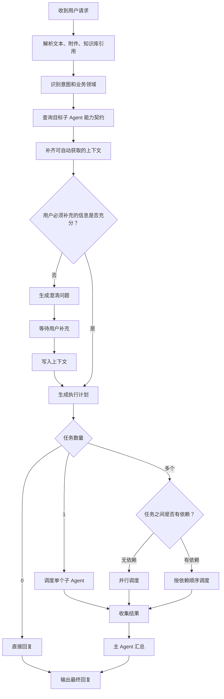
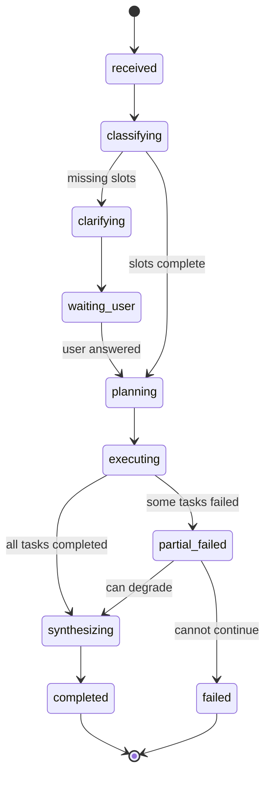
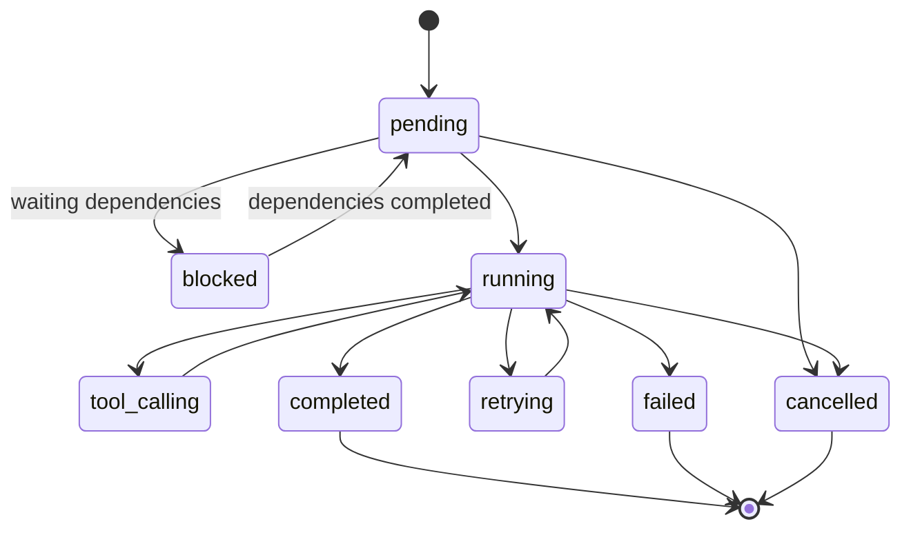

# 多 Agent Demo 架构设计文档

> 面向对象：不熟悉 Agent 的研发同学。
>
> 文档目标：说明“主 Agent 分配任务，子 Agent 执行任务，主 Agent 汇总结果”的完整开发架构，包括整体架构、角色边界、交互协议、系统流程、状态管理、异常处理和落地开发步骤。

## 1. 一句话理解

在这个系统里，Agent 不是一个神秘的新技术，而是一种“会根据上下文做决策的执行单元”。

- **主 Agent** 像项目经理：理解用户需求、判断是否需要追问、拆任务、决定串行或并行、收集结果、输出最终回复。
- **子 Agent** 像专业同事：只负责某类具体任务，例如学情分析、课件生成、组题、批改、导出 Excel。
- **工具** 像可调用的后端能力：读知识库、查作业、生成课件、生成试卷、导出文件。
- **前端** 负责把主 Agent 的判断、子 Agent 的执行过程和最终产物展示给用户。

当前 demo 已经覆盖 5 类核心意图：

| 意图类型 | 含义 | 处理方式 |
| --- | --- | --- |
| `single_full` | 单任务，信息充分 | 主 Agent 直接生成计划并调度一个子 Agent |
| `single_lack` | 单任务，信息不足 | 主 Agent 先追问，拿到必要信息后再执行 |
| `multi_parallel` | 多任务，无依赖 | 主 Agent 同时调度多个子 Agent 并行执行 |
| `multi_depend` | 多任务，有依赖 | 主 Agent 按依赖顺序串行执行子 Agent |
| `other` | 闲聊、问候或不需要工具 | 主 Agent 直接回复，不调度子 Agent |

## 2. 当前 Demo 到真实系统的映射

当前 demo 是前端模拟版，核心逻辑集中在 `agent-demo.html`。真实系统上线时，可以保持同一套产品流程，把模拟脚本替换成后端 Agent 编排服务。

| 当前 demo 概念 | 当前文件中的表现 | 真实系统模块 |
| --- | --- | --- |
| 意图识别 | `intentMeta`、预设问题的 `intentType` | Intent Router / 主 Agent 判断 |
| 澄清追问 | `step4_clarify` | Slot Filling / Clarification |
| 任务计划 | `step5_plan` | Planner |
| 串行执行 | `step6_execute` | Scheduler 按依赖执行 |
| 并行执行 | `step6_executeParallel` | Scheduler 并发执行 |
| 子任务过程 | `runSubTask`、`logs`、`toolSummaries` | Sub-agent Run + Tool Call Events |
| 主 Agent 总结 | 子任务 `summary` + `step7_reply` | Synthesizer |
| 右侧预览 | `openDrawer`、`fillDrawerChunk` | Artifact Preview / 文件产物 |
| 附件/知识库 | `selectedAttachments`、`mockKnowledgeFiles` | Context Manager / Knowledge Service |

## 3. 总体架构



### 3.1 模块职责

| 模块 | 职责 | 不负责 |
| --- | --- | --- |
| 前端 Chat UI | 展示对话、追问选项、执行过程、右侧预览、用户反馈 | 不做真实意图判断，不直接访问业务数据库 |
| Agent API | 接收用户请求，返回流式事件，做鉴权和限流 | 不写复杂业务决策 |
| 主 Agent | 理解需求、根据子 Agent 注册表补齐必要信息、拆任务、编排子 Agent、总结结果 | 不直接实现所有专业任务，不硬编码所有子 Agent 的字段细节 |
| Intent Router | 将用户输入归类为 5 类意图或扩展意图 | 不生成最终业务产物 |
| Context Manager | 管理会话上下文、附件、知识库引用、中间结果 | 不擅自扩大数据访问范围 |
| Agent Registry | 描述每个子 Agent 的能力、输入 schema、输出 schema、上下文需求、可用工具 | 不执行任务 |
| Task Scheduler | 根据依赖关系串行、并行或 DAG 调度任务 | 不改写用户需求 |
| 子 Agent Runner | 执行单个专业任务，调用工具，产出结构化结果 | 不负责最终口吻和全局总结 |
| Tool Gateway | 封装数据查询、文件生成、模型工具、业务接口 | 不做自然语言编排 |
| Artifact Store | 保存和预览生成产物 | 不参与任务判断 |
| Observability | 记录日志、链路、耗时、错误、成本 | 不改变业务逻辑 |

## 4. Agent 分层设计

### 4.1 主 Agent

主 Agent 是整个系统的“大脑”和“调度器”，每次用户请求都先进入主 Agent。

主 Agent 的核心职责：

1. **理解需求**：识别用户想做什么，例如生成课件、学情分析、组题、批改、导出。
2. **判断是否需要用户补充信息**：结合子 Agent 注册表中的 `requiredSlots`、`inputSchema`，以及 Context Manager 已有上下文，判断哪些参数必须向用户追问。
3. **拆解任务**：把用户请求拆成一个或多个可执行子任务。
4. **判断依赖关系**：决定任务是串行、并行，还是更复杂的 DAG。
5. **分配子 Agent**：根据任务类型选择最合适的子 Agent。
6. **汇总结果**：收集子 Agent 的结构化结果，生成用户能看懂的最终回复。
7. **解释过程**：告诉用户为什么这么执行，例如“第二步依赖第一步结果，所以按顺序执行”。

主 Agent 不应该直接把所有事情都做完，也不应该把所有子 Agent 的具体字段写死在自己代码里。它应该读取 Agent Registry，知道“某类任务需要哪些用户参数、哪些系统上下文、哪些前序结果”，再统一向用户澄清和编排执行。

### 4.2 子 Agent

子 Agent 是“专业执行者”。它不直接面对用户，也不负责整体对话策略；它只接收主 Agent 派发的结构化任务，调用被授权的工具，产出结构化结果。

对框架设计来说，不需要在主架构文档里逐项写死每个子 Agent 的所有业务字段。框架只需要规定：**主 Agent 派发任务时，必须把哪些类型的内容交给子 Agent**。具体字段由每个子 Agent 自己的 `AgentCapability` 和 `inputSchema` 声明。

也就是说：

| 层级 | 负责内容 |
| --- | --- |
| 框架层 | 定义统一调用包、调度协议、上下文装配方式、权限边界 |
| 子 Agent 层 | 定义自己具体需要哪些字段、输出什么结构、可以调用哪些工具 |

真实开发中，子 Agent 拿到的不是一段用户原话，而是一个完整的 **Agent 调用包**。这个调用包建议固定分成 7 类信息：

| 类别 | 解决什么问题 | 典型内容 | 主要来源 |
| --- | --- | --- | --- |
| `userQuery` | 让子 Agent 知道用户最初想表达什么 | 用户原话、主 Agent 规整后的表达、和当前任务相关的片段 | 用户输入、主 Agent 摘要 |
| `taskInput` | 告诉子 Agent 当前这一步具体要做什么 | 班级、学科、时间范围、题型、难度、输出格式、任务目标等 | 主 Agent 拆解和澄清结果 |
| `mainAgentContext` | 告诉子 Agent 主 Agent 是怎么理解和规划任务的 | 意图类型、计划摘要、澄清答案、执行约束、期望输出 | 主 Agent |
| `dependencyResults` | 传递前序子任务的结构化结果 | 学情分析结论、错题归因结果、上一步产物 ID | Scheduler / Context Manager |
| `domainContext` | 提供业务配置和教学上下文 | 作文评价维度、评分规则、知识库、班级画像、教材版本 | Context Manager / 业务系统 |
| `runtimeContext` | 提供身份、权限和运行环境 | 老师 ID、老师名称、学校 ID、时区、语言、权限范围 | 登录态 / 权限系统 |
| `artifactContext` | 提供附件和已生成产物引用 | 上传图片、Excel、知识库文件、HTML/PPT/PDF 预览地址 | 文件服务 / Artifact Store |

这 7 类信息的边界要固定下来。否则不同研发可能有的人把老师名称塞进 `taskInput`，有的人把前序分析结果塞进 `mainAgentContext`，后续会很难维护。

### 4.2.1 `userQuery`：用户原始需求

`userQuery` 保存用户最初怎么说，以及主 Agent 对这句话做过的轻量规整。它的作用是保留用户表达的语气、目标和关键词，避免子 Agent 只看到冷冰冰的参数。

建议包含：

| 字段 | 含义 | 示例 |
| --- | --- | --- |
| `original` | 用户原始输入，不改写 | “先分析本次测验薄弱项，再生成讲评课件” |
| `normalized` | 主 Agent 规整后的表达 | “分析初二(3)班本次测验薄弱项，并基于结果生成讲评课件” |
| `relevantExcerpt` | 和当前子任务相关的片段 | 对课件 Agent 来说是“生成讲评课件” |

注意：`userQuery` 不是让子 Agent 重新理解全局需求，而是提供必要的语义参考。真正的执行依据仍然是 `taskInput` 和 `mainAgentContext`。

### 4.2.2 `taskInput`：当前子任务输入

`taskInput` 是子 Agent 最核心的业务输入，表示“这一步具体干什么”。不同子 Agent 的 `taskInput` 字段不同，由各自的 `inputSchema` 定义。

常见内容包括：

| 类型 | 示例 |
| --- | --- |
| 任务对象 | `classId`、`studentIds`、`homeworkId`、`examId` |
| 学科范围 | `subject`、`grade`、`textbookVersion`、`knowledgePoints` |
| 时间范围 | `timeRange`、`startDate`、`endDate` |
| 生成要求 | `outputFormat`、`pageCount`、`questionCount`、`difficulty` |
| 任务目标 | `goal`、`focusArea`、`coursewareType`、`analysisDimension` |

示例：

```json
{
  "classId": "class_8_3",
  "subject": "chinese",
  "timeRange": "last_7_days",
  "focusArea": "argument_writing",
  "outputFormat": "html_report"
}
```

### 4.2.3 `mainAgentContext`：主 Agent 上下文摘要

`mainAgentContext` 是主 Agent 对本轮任务的理解结果。它不是完整聊天记录，而是主 Agent 为当前子 Agent 压缩后的上下文。

建议包含：

| 字段 | 含义 | 示例 |
| --- | --- | --- |
| `intentType` | 当前意图类型 | `multi_depend` |
| `planSummary` | 主 Agent 的计划摘要 | “先分析学情，再生成讲评课件” |
| `clarifiedSlots` | 用户已经补充过的参数 | `{ "classId": "class_8_3" }` |
| `constraints` | 对子任务的执行约束 | `["课件必须基于学情分析结果"]` |
| `expectedOutput` | 主 Agent 期望子 Agent 返回什么 | “8 页 HTML 讲评课件，包含问题概览和练习” |
| `handoffReason` | 为什么把任务交给这个子 Agent | “需要生成教学课件，匹配 courseware_agent 能力” |

### 4.2.4 `dependencyResults`：依赖任务结果

如果任务之间存在依赖，后一个子 Agent 必须拿到前一个子 Agent 的结构化结果。

常见内容包括：

| 内容 | 示例 |
| --- | --- |
| 前序任务 ID | `task_001` |
| 前序 Agent 类型 | `learning_analysis_agent` |
| 前序任务摘要 | “识别出 3 个高频共性问题” |
| 结构化数据 | `topIssues`、`studentGroups`、`knowledgeWeaknesses` |
| 前序产物引用 | `artifact_analysis_001` |

示例：

```json
[
  {
    "taskId": "task_001",
    "agentType": "learning_analysis_agent",
    "summary": "识别出 3 个高频共性问题",
    "data": {
      "topIssues": [
        { "name": "论据偏单一", "count": 18 },
        { "name": "即/既混用", "count": 11 },
        { "name": "开头偏弱", "count": 9 }
      ]
    },
    "artifacts": ["artifact_analysis_001"]
  }
]
```

注意：依赖结果必须结构化。不能只把“上一步总结文本”传给后续 Agent，否则后续 Agent 很难稳定复用。

### 4.2.5 `domainContext`：业务上下文

`domainContext` 是和教学业务有关、但不一定由用户每次输入的信息。它通常由 Context Manager 从业务系统、学校配置、知识库或班级画像中自动补齐。

常见内容包括：

| 内容 | 示例 |
| --- | --- |
| 学科和年级 | `subject`、`grade` |
| 教材和课程配置 | `textbookVersion`、`semester`、`unit` |
| 作文评价维度 | `writingDimensions: ["立意", "结构", "论据", "语言"]` |
| 评分规则 | `rubricId`、`rubricConfig` |
| 班级画像 | 班级人数、平均水平、分层情况、近期薄弱点 |
| 知识库引用 | `knowledgeBaseIds`、教研组资料、评分样例 |
| 学校配置 | 校本题库、校内评分口径、默认导出模板 |

这些信息不应该写死在子 Agent 里。子 Agent 只声明自己需要哪些上下文，例如 `writingDimensions`、`rubricConfig`，由 Context Manager 负责补齐。

### 4.2.6 `runtimeContext`：运行上下文

`runtimeContext` 描述“当前是谁在什么环境下发起任务”。它用于权限控制、审计、个性化和本地化。

建议包含：

| 字段 | 含义 | 示例 |
| --- | --- | --- |
| `teacherId` | 当前老师 ID | `teacher_001` |
| `teacherName` | 当前老师名称 | `王老师` |
| `schoolId` | 学校 ID | `school_001` |
| `role` | 当前用户角色 | `teacher` |
| `permissionScope` | 可访问范围 | `["class_8_3", "class_8_5"]` |
| `timezone` | 时区 | `Asia/Shanghai` |
| `locale` | 语言和地区 | `zh-CN` |
| `requestId` | 当前请求 ID | `req_abc` |
| `traceId` | 链路追踪 ID | `trace_abc` |

注意：`runtimeContext` 可以传老师名称、学校 ID、权限范围，但不要把敏感凭证、API Key、数据库连接串传给子 Agent。

### 4.2.7 `artifactContext`：附件和产物上下文

`artifactContext` 保存用户上传的附件、知识库文件，以及本轮或历史生成的产物引用。

常见内容包括：

| 内容 | 示例 |
| --- | --- |
| 用户上传附件 | 作文照片、成绩 Excel、PDF 讲义 |
| 知识库文件 | 作文素材库、错题归因记录、评分标准 |
| 已生成产物 | 学情报告、课件 HTML、试卷 PDF |
| 预览地址 | `previewUrl` |
| 存储地址 | `storageUri` |
| 文件元信息 | 文件名、类型、大小、上传时间 |

示例：

```json
{
  "attachments": [
    {
      "id": "att_001",
      "kind": "kb",
      "title": "初二语文议论文写作素材库",
      "uri": "kb://writing/materials"
    }
  ],
  "previousArtifacts": [
    {
      "artifactId": "artifact_analysis_001",
      "kind": "html",
      "title": "初二(3)班学情分析报告.html",
      "previewUrl": "/artifacts/artifact_analysis_001/preview"
    }
  ]
}
```

推荐统一调用结构：

```ts
type AgentInvocation<TInput = unknown, TDependency = unknown> = {
  userQuery: {
    original: string;
    normalized?: string;
    relevantExcerpt?: string;
  };

  task: {
    taskId: string;
    title: string;
    goal: string;
    agentType: string;
  };

  taskInput: TInput;

  mainAgentContext: {
    intentType: string;
    clarifiedSlots: Record<string, unknown>;
    planSummary: string;
    constraints: string[];
    expectedOutput: string;
    handoffReason: string;
  };

  dependencyResults: TDependency[];

  domainContext: {
    subject?: string;
    grade?: string;
    textbookVersion?: string;
    writingDimensions?: string[];
    rubricId?: string;
    rubricConfig?: Record<string, unknown>;
    knowledgeBaseIds?: string[];
    classProfile?: Record<string, unknown>;
  };

  runtimeContext: {
    teacherId: string;
    teacherName: string;
    schoolId: string;
    role: string;
    timezone: string;
    locale: "zh-CN";
    permissionScope: string[];
    requestId: string;
    traceId: string;
  };

  artifactContext: {
    attachments: ArtifactRef[];
    previousArtifacts: ArtifactRef[];
  };
};
```

精简到最小必需结构时，也至少要保留：

```ts
type MinimalAgentInvocation<TInput = unknown> = {
  userQuery: { original: string };
  taskInput: TInput;
  mainAgentContext: {
    intentType: string;
    planSummary: string;
    constraints: string[];
  };
  runtimeContext: {
    teacherId: string;
    schoolId: string;
    permissionScope: string[];
  };
};
```

这里要注意两个边界：

1. **主 Agent 上下文需要传给子 Agent，但不等于把完整聊天记录原封不动塞给子 Agent**。主 Agent 应该先做压缩和筛选，只传和当前任务相关的信息。
2. **框架不关心 `taskInput` 里每个业务字段的细节**。框架只保证 `taskInput` 符合目标子 Agent 的 `inputSchema`，具体字段由子 Agent 自己定义。

子 Agent 能力示例：

| 子 Agent | 能力边界 | 常见输出 | 可用工具类型 |
| --- | --- | --- | --- |
| 学情分析 Agent | 分析班级作业、考试或作文表现 | 共性问题、薄弱项、学生分层、分析报告 | 作业数据查询、知识点映射、统计分析 |
| 课件生成 Agent | 根据主题、教学目标或前序分析结果生成课件 | HTML/PPT 课件、大纲、讲解脚本 | 模板库、课件生成、素材检索 |
| AI 组题 Agent | 根据教学目标生成试卷或练习 | 试卷、练习题、答案解析 | 题库、组卷、难度校验 |
| 批改 Agent | 对作业、作文、题目进行批改和归因 | 批改结果、评语、高频错题 | OCR、评分规则、错题归因 |
| 导出 Agent | 把结构化结果导出为指定文件 | Excel/PDF/ZIP 等文件 | 报表生成、文件导出 |

子 Agent 注册表需要声明自己的能力契约：

```ts
type AgentCapability = {
  agentType: string;
  description: string;
  requiredSlots: string[];
  optionalSlots: string[];
  contextRequirements: string[];
  inputSchema: object;
  outputSchema: object;
  allowedTools: string[];
};
```

示例：

```ts
const learningAnalysisAgentCapability: AgentCapability = {
  agentType: "learning_analysis_agent",
  description: "分析班级作业、考试或作文表现，输出共性问题和教学建议",
  requiredSlots: ["classId", "subject", "timeRange"],
  optionalSlots: ["focusArea", "outputFormat"],
  contextRequirements: [
    "teacherProfile",
    "classPermission",
    "writingDimensions",
    "rubricConfig",
    "knowledgeBaseRefs"
  ],
  inputSchema: LearningAnalysisInputSchema,
  outputSchema: LearningAnalysisOutputSchema,
  allowedTools: ["homework.query", "exam.query", "rubric.load", "analysis.aggregate"]
};
```

其中：

- `requiredSlots` 是需要用户提供或主 Agent 澄清出来的参数，例如班级、时间范围、学科。
- `contextRequirements` 是系统可以自动补齐的上下文，例如当前老师名称、作文维度、评分规则、权限范围。
- `inputSchema` 是子 Agent 执行前的最终校验标准。
- `allowedTools` 是子 Agent 能调用的工具白名单。

框架层只依赖这些契约，不直接依赖某个子 Agent 的具体字段。比如学情分析 Agent 未来新增 `writingGenre` 字段，只需要更新自己的 `inputSchema` 和 `requiredSlots`，主 Agent 通过注册表就能知道需要补什么，不需要改整个架构。

子 Agent 的设计原则：

- 输入必须结构化，不能只给一段自然语言。
- 主 Agent 上下文要经过摘要和筛选后传入子 Agent，避免直接传整段聊天历史。
- 子 Agent 需要的业务上下文、运行上下文要由 Context Manager 补齐，不要写死在子 Agent 代码或 prompt 里。
- 输出必须结构化，方便主 Agent 汇总。
- 只能调用自己被授权的工具。
- 每个子 Agent 都要返回过程事件，前端才能展示“正在读取数据”“正在生成课件”等进度。
- 子 Agent 不直接向用户澄清。它只做输入校验；如果发现输入不合法，返回结构化错误，交给主 Agent 统一处理。
- 子 Agent 可以失败，但失败必须可解释、可重试、可降级。

## 5. 主子 Agent 交互协议

建议所有 Agent 之间都使用统一消息协议。这样前端、后端、日志系统和测试用例都能复用同一套结构。

### 5.1 通用消息信封

```ts
type AgentMessage<T = unknown> = {
  messageId: string;
  traceId: string;
  conversationId: string;
  runId: string;
  parentRunId?: string;
  from: string;
  to: string;
  type:
    | "user_request"
    | "clarification_question"
    | "clarification_answer"
    | "execution_plan"
    | "task_dispatch"
    | "task_progress"
    | "task_result"
    | "final_response"
    | "error";
  createdAt: string;
  payload: T;
};
```

关键字段说明：

| 字段 | 说明 |
| --- | --- |
| `traceId` | 一次用户请求的全链路追踪 ID |
| `conversationId` | 对话 ID，用于恢复上下文 |
| `runId` | 当前 Agent 运行 ID |
| `parentRunId` | 子 Agent 对应的主 Agent 运行 ID |
| `from/to` | 消息发送方和接收方 |
| `type` | 消息类型，驱动状态机 |
| `payload` | 不同消息类型的业务内容 |

### 5.2 用户请求

```json
{
  "messageId": "msg_001",
  "traceId": "trace_abc",
  "conversationId": "conv_001",
  "runId": "run_main_001",
  "from": "user",
  "to": "main_agent",
  "type": "user_request",
  "createdAt": "2026-05-26T10:00:00+08:00",
  "payload": {
    "text": "先分析本次测验薄弱项，再生成讲评课件",
    "attachments": [
      {
        "id": "att_001",
        "kind": "kb",
        "title": "初二(3)班近 30 天作业表现",
        "uri": "kb://class-3/homework-30d"
      }
    ],
    "userContext": {
      "role": "teacher",
      "schoolId": "school_001",
      "preferredClassId": "class_8_3"
    }
  }
}
```

### 5.3 意图识别结果

```ts
type IntentResult = {
  intentType: "single_full" | "single_lack" | "multi_parallel" | "multi_depend" | "other";
  domain: "courseware" | "animation" | "analysis" | "grading" | "misprint" | "quiz" | "chat";
  confidence: number;
  targetAgents: string[];
  missingUserSlots: string[];
  requiredContext: string[];
  reason: string;
};
```

示例：

```json
{
  "intentType": "multi_depend",
  "domain": "courseware",
  "confidence": 0.92,
  "targetAgents": ["learning_analysis_agent", "courseware_agent"],
  "missingUserSlots": ["classId"],
  "requiredContext": ["teacherProfile", "classPermission", "writingDimensions"],
  "reason": "用户要求先分析薄弱项，再生成讲评课件；第二步依赖第一步分析结果"
}
```

### 5.4 澄清问题

当 `missingUserSlots` 不为空时，主 Agent 先向用户追问。这里的待澄清参数不是主 Agent 自己硬编码出来的，而是根据目标子 Agent 的 `requiredSlots`、`inputSchema` 和当前上下文共同判断出来的。

```json
{
  "type": "clarification_question",
  "payload": {
    "question": "好的。你这次想分析哪个班级？",
    "slots": ["classId"],
    "options": [
      { "label": "初二(3)班", "value": "class_8_3" },
      { "label": "初二(5)班", "value": "class_8_5" },
      { "label": "初二(7)班", "value": "class_8_7" }
    ],
    "allowCustomInput": true,
    "customPlaceholder": "比如：初三(2)班，只看作文部分"
  }
}
```

澄清规则：

- 一次只问最关键的问题，避免用户负担过重。
- 优先给可点击选项，必要时允许自定义输入。
- 澄清答案写回 Context Manager，后续任务不能再丢失。
- 如果用户附件已经提供了关键信息，不要重复追问。
- 子 Agent 不直接向用户追问；如果执行前校验失败，返回结构化错误，由主 Agent 统一处理。

### 5.5 执行计划

主 Agent 补齐信息后，生成计划。

```json
{
  "type": "execution_plan",
  "payload": {
    "planId": "plan_001",
    "strategy": "sequential",
    "userVisibleText": "明白了。第二步依赖第一步的分析结果，我会按顺序执行。",
    "tasks": [
      {
        "taskId": "task_001",
        "agentType": "learning_analysis_agent",
        "title": "分析班级学情",
        "dependsOn": [],
        "input": {
          "classId": "class_8_3",
          "timeRange": "last_7_days",
          "subject": "chinese"
        },
        "outputSchema": "LearningAnalysisResult"
      },
      {
        "taskId": "task_002",
        "agentType": "courseware_agent",
        "title": "生成讲评课件",
        "dependsOn": ["task_001"],
        "input": {
          "classId": "class_8_3",
          "coursewareType": "lecture_review",
          "sourceTaskResult": "task_001"
        },
        "outputSchema": "CoursewareResult"
      }
    ]
  }
}
```

执行计划里的 `input` 是任务级输入示例，不是框架固定字段。真实实现时，主 Agent 先根据子 Agent 注册表校验这些输入，再由 Context Manager 补齐业务上下文、运行上下文和依赖结果，最终组装成 `AgentInvocation` 派发给子 Agent。

### 5.6 子任务派发

主 Agent 不直接调用子 Agent 的内部实现，而是通过 Scheduler 派发任务。Scheduler 派发给子 Agent 的应该是完整 `AgentInvocation`，而不是只传几个散落参数。

```json
{
  "type": "task_dispatch",
  "from": "task_scheduler",
  "to": "courseware_agent",
  "payload": {
    "invocation": {
      "userQuery": {
        "original": "先分析本次测验薄弱项，再生成讲评课件",
        "normalized": "分析初二(3)班本次测验薄弱项，并基于结果生成讲评课件",
        "relevantExcerpt": "生成讲评课件"
      },
      "task": {
        "taskId": "task_002",
        "title": "生成讲评课件",
        "goal": "基于学情分析结果生成一份班级讲评课件",
        "agentType": "courseware_agent"
      },
      "taskInput": {
        "classId": "class_8_3",
        "coursewareType": "lecture_review"
      },
      "mainAgentContext": {
        "intentType": "multi_depend",
        "clarifiedSlots": { "classId": "class_8_3" },
        "planSummary": "先分析班级薄弱项，再基于分析结果生成讲评课件",
        "constraints": ["第二步必须使用第一步的分析结论"],
        "expectedOutput": "8 页 HTML 讲评课件，包含问题概览、案例讲评和课后练习",
        "handoffReason": "需要生成教学课件，匹配 courseware_agent 能力"
      },
      "dependencyResults": [
        {
          "taskId": "task_001",
          "agentType": "learning_analysis_agent",
          "summary": "识别出 3 个高频共性问题",
          "data": {
            "topIssues": [
              { "name": "议论文论据偏单一", "count": 18 },
              { "name": "即/既混用", "count": 11 },
              { "name": "开头偏弱", "count": 9 }
            ]
          },
          "artifacts": ["artifact_analysis_001"]
        }
      ],
      "domainContext": {
        "subject": "chinese",
        "grade": "初二",
        "writingDimensions": ["立意", "结构", "论据", "语言"]
      },
      "runtimeContext": {
        "teacherId": "teacher_001",
        "teacherName": "王老师",
        "schoolId": "school_001",
        "role": "teacher",
        "timezone": "Asia/Shanghai",
        "locale": "zh-CN",
        "permissionScope": ["class_8_3"],
        "requestId": "req_abc",
        "traceId": "trace_abc"
      },
      "artifactContext": {
        "attachments": [],
        "previousArtifacts": []
      }
    },
    "constraints": {
      "timeoutMs": 120000,
      "maxToolCalls": 20,
      "allowedTools": ["template.search", "courseware.render_html", "artifact.save"]
    },
    "expectedOutputSchema": "CoursewareResult"
  }
}
```

### 5.7 任务进度事件

子 Agent 执行过程中持续上报事件，前端用这些事件渲染“执行过程”。

```ts
type TaskProgressEvent = {
  taskId: string;
  agentType: string;
  status: "pending" | "running" | "tool_calling" | "completed" | "failed";
  title: string;
  progressText: string;
  toolCall?: {
    toolName: string;
    status: "started" | "succeeded" | "failed";
    inputSummary?: string;
    outputSummary?: string;
    durationMs?: number;
  };
};
```

示例：

```json
{
  "type": "task_progress",
  "payload": {
    "taskId": "task_001",
    "agentType": "learning_analysis_agent",
    "status": "tool_calling",
    "title": "分析班级学情",
    "progressText": "已拿到 35 份作业、12 篇周记，数据完整",
    "toolCall": {
      "toolName": "homework.query",
      "status": "succeeded",
      "outputSummary": "35 份作业、12 篇周记",
      "durationMs": 1830
    }
  }
}
```

### 5.8 子任务结果

```json
{
  "type": "task_result",
  "payload": {
    "taskId": "task_001",
    "agentType": "learning_analysis_agent",
    "status": "completed",
    "summary": "近 7 天共 35 份作业、12 篇周记。班级最突出的 3 个共性问题是论据偏单一、即/既混用、开头偏弱。",
    "structuredOutput": {
      "classId": "class_8_3",
      "timeRange": "last_7_days",
      "topIssues": [
        { "name": "论据偏单一", "count": 18, "ratio": 0.51 },
        { "name": "即/既混用", "count": 11, "ratio": 0.31 },
        { "name": "开头偏弱", "count": 9, "ratio": 0.26 }
      ]
    },
    "artifacts": [
      {
        "artifactId": "artifact_analysis_001",
        "kind": "html",
        "title": "初二(3)班 · 近 7 天学情分析报告.html",
        "previewUrl": "/artifacts/artifact_analysis_001/preview"
      }
    ]
  }
}
```

### 5.9 最终总结

主 Agent 收到所有子任务结果后，统一生成最终回复。

```json
{
  "type": "final_response",
  "payload": {
    "text": "课件已生成，共 8 页，涵盖班级整体表现、3 个高频问题剖析和课后练习。已在右侧打开预览。",
    "artifacts": [
      {
        "artifactId": "artifact_courseware_001",
        "kind": "html",
        "title": "初二(3)班 · 议论文讲评课件.html",
        "previewUrl": "/artifacts/artifact_courseware_001/preview"
      }
    ],
    "followups": [
      "这些错题对应哪些知识点？",
      "再给一份学生版课后练习",
      "把课件导出成 PDF"
    ]
  }
}
```

## 6. 系统执行流程

### 6.1 总流程



### 6.2 主 Agent 决策流程



### 6.3 串行与并行判断

判断标准不是“用户说了几个任务”，而是“后一个任务是否需要前一个任务的输出”。

| 用户说法 | 判断 | 原因 |
| --- | --- | --- |
| “先分析薄弱项，再生成讲评课件” | 串行 | 课件内容依赖学情分析结果 |
| “根据本周作业生成班级讲评课件” | 串行 | 隐含先分析作业，再生成课件 |
| “同时生成数学卷和语文阅读练习” | 并行 | 两份材料相互独立 |
| “给基础组和提高组各出一套练习” | 并行 | 两套练习可同时生成 |
| “导出初二(3)班本次作业批改结果 Excel” | 单任务 | 参数充分，直接导出 |

推荐用 DAG 表达任务依赖：

```ts
type TaskNode = {
  taskId: string;
  agentType: string;
  title: string;
  dependsOn: string[];
  taskInput: Record<string, unknown>;
};

type ExecutionGraph = {
  strategy: "single" | "parallel" | "sequential" | "dag";
  tasks: TaskNode[];
};
```

调度规则：

```ts
async function runGraph(graph: ExecutionGraph) {
  const completed = new Map<string, TaskResult>();
  const pending = new Map(graph.tasks.map(task => [task.taskId, task]));

  while (pending.size > 0) {
    const readyTasks = [...pending.values()].filter(task =>
      task.dependsOn.every(depId => completed.has(depId))
    );

    if (readyTasks.length === 0) {
      throw new Error("Task dependency cycle detected");
    }

    const results = await Promise.all(
      readyTasks.map(task => {
        const invocation = buildAgentInvocation(task, completed);
        return runSubAgent(invocation);
      })
    );

    for (const result of results) {
      completed.set(result.taskId, result);
      pending.delete(result.taskId);
    }
  }

  return [...completed.values()];
}
```

`buildAgentInvocation` 是调度层的关键装配动作：它把 `userQuery`、`taskInput`、`mainAgentContext`、`dependencyResults`、`domainContext`、`runtimeContext` 和 `artifactContext` 合并成统一调用包。

## 7. 状态机设计

### 7.1 会话运行状态



### 7.2 子任务状态



任务状态要持久化，避免页面刷新或服务重启后丢失进度。

## 8. 上下文管理

Agent 系统最容易出问题的地方是上下文混乱。建议在存储和管理上先把上下文拆成 5 层，再在派发子 Agent 时装配成前面定义的 7 类 `AgentInvocation`。

| 上下文层 | 内容 | 使用者 |
| --- | --- | --- |
| 用户输入 | 当前这句话、澄清答案 | 主 Agent |
| 会话上下文 | 历史消息、上轮产物、用户偏好 | 主 Agent |
| 业务上下文 | 班级、学科、时间范围、知识点 | 主 Agent、子 Agent |
| 附件上下文 | 图片、Excel、知识库文件、上传材料 | 子 Agent、工具 |
| 中间结果 | 前序子 Agent 输出，例如学情分析结果 | 后续依赖任务 |

上下文原则：

- 子 Agent 只拿完成任务所需的最小上下文。
- 附件用 `uri` 或 `artifactId` 引用，不要在 Agent 间传大文件原文。
- 前序结果必须结构化保存，不能只保存自然语言总结。
- 主 Agent 汇总时可以读取所有任务结果，子 Agent 不应读取无关任务结果。
- 每次工具调用都要记录使用了哪些上下文，方便排查问题。
- 主 Agent 负责把用户输入、澄清答案、能力契约、依赖结果、自动补齐的上下文装配成 `AgentInvocation`。
- 框架层定义上下文分层和装配规则；具体业务字段由子 Agent 的 schema 决定。

## 9. 工具调用设计

工具是 Agent 连接真实业务能力的入口。所有工具建议经过 Tool Gateway 统一封装。

### 9.1 工具定义

```ts
type ToolDefinition = {
  name: string;
  description: string;
  inputSchema: object;
  outputSchema: object;
  timeoutMs: number;
  idempotent: boolean;
  permission: string;
};
```

示例：

```json
{
  "name": "homework.query",
  "description": "按班级、学科和时间范围查询作业数据",
  "inputSchema": {
    "classId": "string",
    "subject": "string",
    "timeRange": "string"
  },
  "outputSchema": {
    "homeworkCount": "number",
    "records": "array"
  },
  "timeoutMs": 10000,
  "idempotent": true,
  "permission": "homework:read"
}
```

### 9.2 工具调用约束

- 每个子 Agent 配置工具白名单。
- 工具输入必须通过 schema 校验。
- 工具输出必须做摘要，避免把大段数据塞回模型上下文。
- 写操作工具必须支持幂等键，例如 `idempotencyKey`。
- 高风险工具需要权限校验和审计日志。
- 工具失败要返回结构化错误，不要只返回一段报错文本。

## 10. 前端事件流

真实后端建议用 SSE 或 WebSocket 推送事件。前端只关心事件类型，不需要知道后端内部怎么跑。

```ts
type FrontendEvent =
  | { type: "message.delta"; text: string }
  | { type: "clarification.show"; question: ClarificationQuestion }
  | { type: "plan.show"; plan: ExecutionPlan }
  | { type: "task.started"; task: TaskView }
  | { type: "task.progress"; taskId: string; text: string }
  | { type: "task.completed"; taskId: string; summary: string }
  | { type: "artifact.preview"; artifact: Artifact }
  | { type: "final.show"; response: FinalResponse }
  | { type: "error.show"; error: UserVisibleError };
```

前端展示建议：

- 主 Agent 判断：展示意图、是否需要澄清、为什么串行或并行。
- 子 Agent 状态：每个任务一张卡，展示运行中、并行、已完成、失败。
- 工具过程：展示关键过程摘要，例如“已读取 35 份作业”。
- 过程折叠：完成后默认折叠执行过程，保留“查看过程”入口。
- 产物预览：右侧 drawer 展示报告、课件、试卷、Excel 等。
- 反馈入口：最终回复后提供“有帮助 / 不准确”。

## 11. 数据表建议

最小可用版本可以从这些表开始。

### 11.1 `conversations`

| 字段 | 说明 |
| --- | --- |
| `id` | 会话 ID |
| `user_id` | 用户 ID |
| `title` | 会话标题 |
| `created_at` | 创建时间 |
| `updated_at` | 更新时间 |

### 11.2 `messages`

| 字段 | 说明 |
| --- | --- |
| `id` | 消息 ID |
| `conversation_id` | 会话 ID |
| `role` | `user` / `assistant` / `tool` |
| `content` | 消息内容 |
| `metadata` | 附件、意图、产物引用 |
| `created_at` | 创建时间 |

### 11.3 `agent_runs`

| 字段 | 说明 |
| --- | --- |
| `id` | 运行 ID |
| `conversation_id` | 会话 ID |
| `parent_run_id` | 父运行 ID |
| `agent_type` | `main_agent` 或子 Agent 类型 |
| `status` | 运行状态 |
| `input` | 结构化输入 |
| `output` | 结构化输出 |
| `error` | 错误信息 |
| `created_at` / `updated_at` | 时间 |

### 11.4 `tasks`

| 字段 | 说明 |
| --- | --- |
| `id` | 任务 ID |
| `run_id` | 所属主 Agent run |
| `agent_type` | 子 Agent 类型 |
| `title` | 任务标题 |
| `depends_on` | 依赖任务 ID 数组 |
| `status` | 任务状态 |
| `input` | 任务输入 |
| `output` | 任务输出 |

### 11.5 `task_events`

| 字段 | 说明 |
| --- | --- |
| `id` | 事件 ID |
| `task_id` | 任务 ID |
| `event_type` | 事件类型 |
| `text` | 用户可见摘要 |
| `raw` | 调试用原始信息 |
| `created_at` | 创建时间 |

### 11.6 `artifacts`

| 字段 | 说明 |
| --- | --- |
| `id` | 产物 ID |
| `conversation_id` | 会话 ID |
| `task_id` | 来源任务 ID |
| `kind` | `html` / `pptx` / `xlsx` / `pdf` / `zip` |
| `title` | 文件名 |
| `storage_uri` | 存储地址 |
| `preview_url` | 预览地址 |
| `created_at` | 创建时间 |

## 12. Prompt 与输出约束

### 12.1 主 Agent System Prompt 应包含

- 你是主 Agent，负责理解需求、澄清、拆解、调度、总结。
- 你需要根据 Agent Registry 判断目标子 Agent 需要哪些用户参数和系统上下文。
- 不要直接编造工具结果。
- 缺少用户必须补充的关键参数时必须追问；可由系统自动补齐的上下文交给 Context Manager。
- 多任务时必须判断依赖关系。
- 输出计划必须结构化。
- 子 Agent 结果冲突时必须说明不确定性。
- 面向老师输出，语言简洁、可操作。

### 12.2 子 Agent System Prompt 应包含

- 你是某个专业子 Agent，只处理指定任务。
- 必须遵守输入 schema 和 `AgentInvocation` 中的上下文边界。
- 只能调用白名单工具。
- 不要访问无关上下文。
- 不直接向用户澄清；输入不合法时返回结构化错误。
- 每次工具调用后生成用户可见过程摘要。
- 最终返回结构化结果，不要只返回自然语言。

### 12.3 推荐输出格式

所有 Agent 输出都建议使用 JSON schema 或强类型结构，不建议让模型自由发挥。

```ts
type SubAgentOutput<T> = {
  status: "completed" | "failed" | "partial";
  summary: string;
  data: T;
  artifacts: Artifact[];
  warnings: string[];
  nextSuggestions: string[];
};
```

## 13. 异常处理

| 场景 | 处理方式 | 用户可见说明 |
| --- | --- | --- |
| 意图识别低置信度 | 追问确认 | “我理解你想做 A，是这样吗？” |
| 缺少用户必须补充的参数 | 主 Agent 根据子 Agent 能力契约发起 Slot 澄清 | “需要先确认班级和时间范围。” |
| 自动上下文补齐失败 | 停止相关任务或提示授权 | “当前无法读取作文评分维度，请检查配置或权限。” |
| 子 Agent 超时 | 重试 1 次，仍失败则降级 | “课件生成耗时较长，我先给你大纲。” |
| 并行任务部分失败 | 成功部分先返回，失败部分可重试 | “数学卷已完成，语文练习生成失败，可重新生成。” |
| 串行前序失败 | 阻断后续依赖任务 | “学情分析失败，暂时无法生成基于学情的讲评课件。” |
| 工具权限不足 | 停止任务并提示授权 | “当前账号没有读取该班级数据的权限。” |
| 输出校验失败 | 要求子 Agent 修复格式 | 一般不直接暴露给用户 |
| 产物保存失败 | 保留文本结果，提示文件生成失败 | “内容已生成，但文件保存失败。” |

异常处理原则：

- 能重试的自动重试，但限制次数。
- 能降级的给出部分结果。
- 不能继续的要说明卡在哪一步。
- 所有失败都要记录 `traceId`，方便研发排查。

## 14. 安全与权限

多 Agent 系统会自动调用工具，必须明确安全边界。

必要措施：

- **用户鉴权**：每个请求必须知道用户是谁。
- **业务鉴权**：老师只能访问自己有权限的班级、学生、文件。
- **工具白名单**：子 Agent 只能调用被授权工具。
- **上下文隔离**：不同学校、班级、用户的数据不能混用。
- **Prompt Injection 防护**：附件和网页内容只能作为数据，不能覆盖系统指令。
- **敏感信息脱敏**：日志中避免保存学生隐私、完整身份证、手机号等敏感字段。
- **审计日志**：记录谁在什么时候生成、导出、查看了哪些文件。
- **人工确认**：涉及发送给家长、批量发布、覆盖数据等高风险动作时，需要用户二次确认。

## 15. 可观测性

研发排查问题时，至少需要看到 4 类信息。

| 类型 | 示例 |
| --- | --- |
| Trace | 一次用户请求经过主 Agent、Scheduler、子 Agent、工具的全链路 |
| Event | `intent_detected`、`task_started`、`tool_call_succeeded`、`task_failed` |
| Metric | 平均耗时、失败率、重试率、工具调用次数、token 成本 |
| Artifact | 本次生成的报告、课件、试卷、Excel 文件 |

推荐日志结构：

```json
{
  "traceId": "trace_abc",
  "conversationId": "conv_001",
  "runId": "run_main_001",
  "taskId": "task_001",
  "agentType": "learning_analysis_agent",
  "event": "tool_call_succeeded",
  "toolName": "homework.query",
  "durationMs": 1830,
  "createdAt": "2026-05-26T10:01:00+08:00"
}
```

## 16. 开发落地步骤

### 阶段 1：保留当前前端体验，接入后端模拟接口

目标：把 `agent-demo.html` 中的静态脚本，替换为后端返回事件。

要做：

1. 定义 `FrontendEvent` 事件协议。
2. 新增 `/api/agent/runs` 创建运行。
3. 新增 `/api/agent/runs/:id/events` SSE 事件流。
4. 后端先用 mock 数据返回当前 5 类意图流程。
5. 前端改为消费事件，不再写死完整流程。

验收：

- 当前 5 类 demo 效果不变。
- 刷新页面后能恢复任务状态。
- 前端不用知道某个任务是 mock 还是真实 Agent。

### 阶段 2：实现主 Agent 的真实意图识别和澄清

目标：用户不再只能点预设，也可以自由输入。

要做：

1. 实现 Intent Router。
2. 实现 Agent Registry，读取子 Agent 的 `requiredSlots`、`contextRequirements` 和 `inputSchema`。
3. 实现缺失用户参数判断。
4. 实现 Context Manager 自动补齐业务上下文和运行上下文。
5. 实现澄清问题生成。
6. 澄清答案写回 Context Manager。

验收：

- “帮我分析学情”会追问班级和时间。
- “导出初二(3)班本次作业批改结果 Excel”能直接执行。
- “同时生成数学卷和语文阅读练习”能识别为并行。

### 阶段 3：实现 Scheduler 和子 Agent Runner

目标：真实支持单任务、并行、多步骤依赖任务。

要做：

1. 定义 `ExecutionPlan`、`TaskNode` 和 `AgentInvocation`。
2. 实现 DAG 调度。
3. 实现子 Agent 注册表。
4. 实现 `buildAgentInvocation`，把 7 类输入装配给子 Agent：`userQuery`、`taskInput`、`mainAgentContext`、`dependencyResults`、`domainContext`、`runtimeContext`、`artifactContext`。
5. 实现任务事件持久化。
6. 前端展示真实任务事件。

验收：

- 串行任务中，第二个任务能拿到第一个任务的结构化结果。
- 并行任务能同时执行，并分别展示进度。
- 任一子任务失败时，前端能展示可理解错误。

### 阶段 4：接入真实工具和产物存储

目标：从“演示过程”升级为“真实可用”。

要做：

1. 接入作业、考试、题库、知识库等业务接口。
2. 实现 Tool Gateway。
3. 实现 Artifact Store。
4. 实现 HTML/PPT/Excel/PDF 产物生成。
5. 实现权限和审计。

验收：

- 学情分析能读取真实班级数据。
- 课件、试卷、Excel 可以真实预览和下载。
- 所有工具调用有权限校验和日志。

## 17. 测试策略

### 17.1 单元测试

- 意图分类：输入不同用户话术，验证 `intentType`。
- Slot 判断：根据目标子 Agent 的 `requiredSlots` 识别缺少的用户参数。
- 上下文装配：能把老师身份、作文维度、权限范围等自动补齐到 `AgentInvocation`。
- DAG 调度：依赖任务按顺序执行，无依赖任务并行执行。
- 输出 schema：Agent 输出不符合 schema 时能拦截。

### 17.2 集成测试

- `single_full`：直接执行并返回文件。
- `single_lack`：先澄清，再执行。
- `multi_parallel`：两个任务同时开始，分别完成。
- `multi_depend`：第二个任务能读取第一个任务结果。
- `other`：不调用工具，直接回复。

### 17.3 端到端测试

覆盖当前 demo 的核心样例：

| 用例 | 预期 |
| --- | --- |
| “根据本周作业生成班级讲评课件” | 先分析学情，再生成课件 |
| “把《背影》整理成课堂导入课件” | 缺少课件要求时先澄清 |
| “同时生成一份数学卷和一份语文阅读练习” | 两个子任务并行执行 |
| “导出初二(3)班本次作业批改结果 Excel” | 直接导出 |
| “你好” | 直接聊天回复 |

## 18. 研发分工建议

| 角色 | 负责内容 |
| --- | --- |
| 前端 | 事件流消费、任务卡、澄清组件、右侧预览、反馈 |
| 后端应用 | Agent API、SSE、鉴权、任务状态、数据表 |
| Agent 工程 | 主 Agent、子 Agent、Prompt、schema、调度逻辑 |
| 业务服务 | 作业、题库、课件、导出、知识库等工具接口 |
| 测试 | 5 类意图主链路、异常链路、权限和回归 |
| 运维/平台 | 日志、Trace、指标、告警、成本统计 |

## 19. 最小可运行接口

如果要快速从 demo 进入工程实现，建议先实现这 3 个接口。

### 19.1 创建 Agent 运行

```http
POST /api/agent/runs
Content-Type: application/json
```

```json
{
  "conversationId": "conv_001",
  "text": "先分析本次测验薄弱项，再生成讲评课件",
  "attachments": []
}
```

返回：

```json
{
  "runId": "run_main_001",
  "traceId": "trace_abc",
  "eventStreamUrl": "/api/agent/runs/run_main_001/events"
}
```

### 19.2 订阅运行事件

```http
GET /api/agent/runs/run_main_001/events
Accept: text/event-stream
```

事件示例：

```text
event: plan.show
data: {"strategy":"sequential","text":"第二步依赖第一步结果，我会按顺序执行。"}

event: task.progress
data: {"taskId":"task_001","text":"已拿到 35 份作业、12 篇周记，数据完整"}

event: final.show
data: {"text":"课件已生成，共 8 页。","artifacts":[{"artifactId":"artifact_001"}]}
```

### 19.3 提交澄清答案

```http
POST /api/agent/runs/run_main_001/clarifications
Content-Type: application/json
```

```json
{
  "answers": {
    "classId": "class_8_3",
    "timeRange": "last_7_days"
  }
}
```

## 20. 开发注意事项

- 不要让前端硬编码业务流程；前端只消费事件。
- 不要让子 Agent 自由决定访问哪些数据；必须由主 Agent 和权限系统限制。
- 不要只保存最终回复；中间任务、工具调用和产物都要可追踪。
- 不要把前序任务结果只写成自然语言；后续依赖任务需要结构化数据。
- 不要为了“多 Agent”而拆太细；能由一个子 Agent 稳定完成的任务，不必再拆。
- 不要把并行任务写死成两个；用 DAG 调度，未来可以自然扩展到多个任务。
- 不要在模型输出未校验时直接生成文件或执行写操作。

## 21. 推荐的第一版目录结构

```text
src/
  agent/
    main-agent.ts
    intent-router.ts
    planner.ts
    synthesizer.ts
    schemas.ts
  agent-registry/
    index.ts
    learning-analysis.agent.ts
    courseware.agent.ts
    quiz.agent.ts
    grading.agent.ts
    export.agent.ts
  scheduler/
    task-scheduler.ts
    dag.ts
  tools/
    tool-gateway.ts
    homework.tool.ts
    question-bank.tool.ts
    artifact.tool.ts
  context/
    context-manager.ts
  api/
    runs.controller.ts
    events.controller.ts
  storage/
    conversations.repo.ts
    runs.repo.ts
    artifacts.repo.ts
```

## 22. 最终标准

这套多 Agent 架构是否合格，可以用 6 个问题判断：

1. 用户一句自然语言进来，系统能判断是否需要追问吗？
2. 主 Agent 能把任务拆成结构化计划吗？
3. 子 Agent 的输入、输出、工具权限是否清晰？
4. 有依赖任务能把前序结果传给后续任务吗？
5. 并行任务能独立执行、独立展示、独立失败吗？
6. 最终回复是否由主 Agent 汇总，而不是多个子 Agent 各说各话？

如果这 6 个问题都能回答“是”，这个 demo 就具备了从前端演示走向真实多 Agent 产品的工程骨架。
